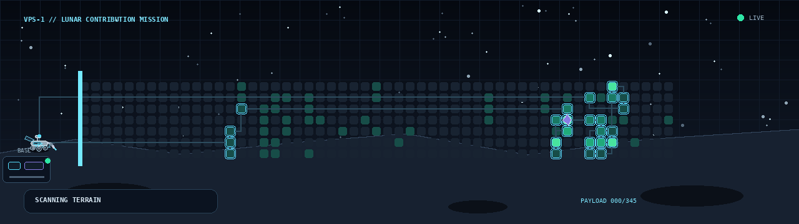

  

<h1 align="center">Vijay Pratap Singh</h1>

  <strong>Computer Science Student @ Illinois Tech</strong> 
  AI/ML • Backend Systems • Robotics

  <a href="https://www.linkedin.com/in/vijay-pratap-singh-"><strong>LinkedIn</strong></a>
  &nbsp;•&nbsp;
  <a href="mailto:singhvijaypratap1011@gmail.com"><strong>Email</strong></a>
  &nbsp;•&nbsp;
  <a href="https://github.com/vijaypratap3364?tab=repositories"><strong>Repositories</strong></a>

  Building real-world AI/ML and software systems. 
  Open to AI/ML and SWE internships, research, and impactful engineering projects.

---

## Featured Missions

### [Issue Localizer](https://github.com/vijaypratap3364/issue-localizer)

Agentic bug-localization and evaluation pipeline built from real GitHub issue–PR mappings.

- Indexed source code with sentence-transformer embeddings and ChromaDB
- Built a Gemini-powered tool-calling agent and evaluation harness
- Improved recall by **24%** and F1 by **15% relative**
- Reached a **31.5% full-hit rate**

`Python` `GraphQL` `Gemini API` `sentence-transformers` `ChromaDB`

---

### [AI Fraud Detection](https://github.com/vijaypratap3364/ai-fraud-detection)

Fraud classification and investigation support system using real-world transaction data.

- Trained an XGBoost classifier with SMOTE
- Added similarity search across historical fraud cases
- Built a live Streamlit investigation dashboard
- Achieved **0.86 PR-AUC** and **92.9% precision at 79.6% recall**

`Python` `XGBoost` `SMOTE` `ChromaDB` `Streamlit` `scikit-learn`

---

### [Production MLOps Ticket Router](https://github.com/vijaypratap3364/production-mlops-ticket-router)

End-to-end ML ticket-routing system with experiment tracking, deployment, and monitoring.

- Added data validation, text features, model registration, and drift monitoring
- Containerized the service and automated testing through GitHub Actions
- Achieved **0.89 macro-F1**
- Reached **95 ms inference latency**

`Python` `FastAPI` `MLflow` `Docker` `GitHub Actions` `Streamlit`

---

## Engineering Toolkit

**Languages:** Python, Java, C++, SQL, JavaScript, HTML, CSS  
**AI/ML:** XGBoost, scikit-learn, sentence-transformers, LLM integration  
**Backend & Data:** FastAPI, REST APIs, PostgreSQL, ChromaDB  
**Engineering:** Git, GitHub Actions, MLflow, Docker, Linux

---

## Highlights

- **1st Place — FinTech Track**, Scarlet Hacks 2026
- **4.00 GPA**, B.S. Computer Science at Illinois Institute of Technology
- **Dean's List**, four consecutive semesters
- Balanced Man Scholarship recipient

---

<strong>How Lunabot works</strong>

 

1. A scheduled GitHub Actions workflow requests the public contribution calendar.
2. The calendar becomes a 53×7 lunar resource map.
3. High-value contribution cells are selected as mining targets.
4. VPS-1 plans a route, mines the deposits, and returns to base.
5. The profile GIF and its static fallback are regenerated only when the underlying data changes.

The implementation includes contribution-data validation, route planning, animated GIF rendering, automated tests, and daily deployment.

---

  <a href="mailto:singhvijaypratap1011@gmail.com"><strong>Open a channel</strong></a>
  &nbsp;•&nbsp;
  <a href="https://www.linkedin.com/in/vijay-pratap-singh-"><strong>Connect on LinkedIn</strong></a>

